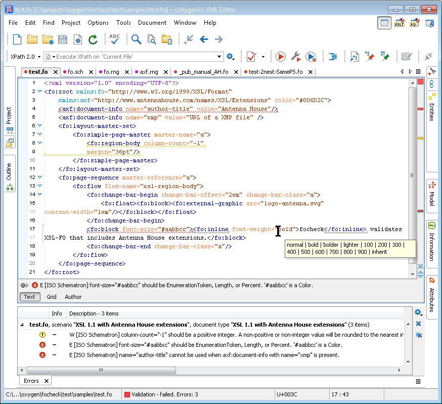
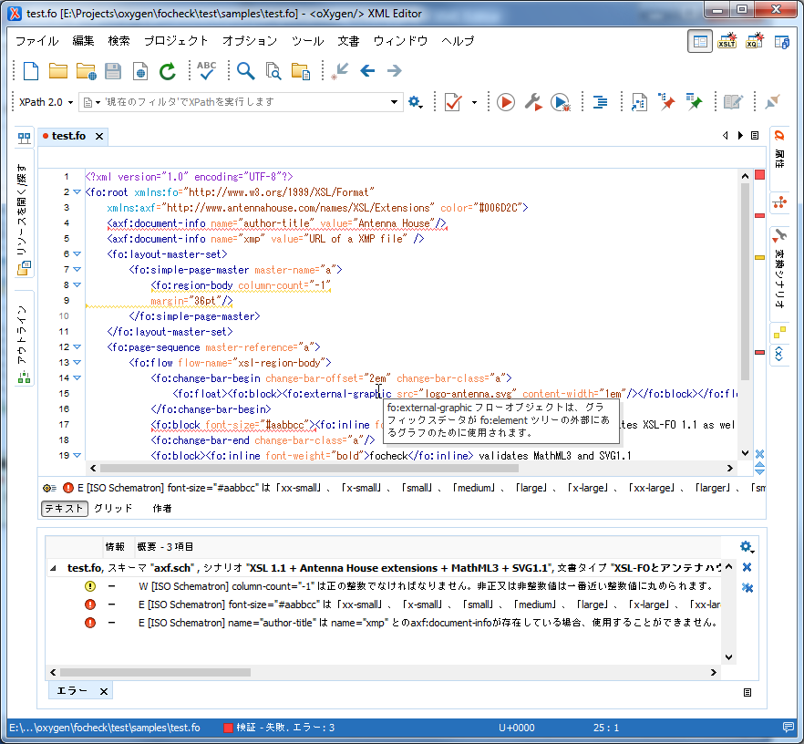

* [English](#en)
* [日本語](#ja)

----

# <a name="en"></a>focheck – Validate XSL-FO and Antenna House extensions in oXygen or standalone

**focheck** bundles a Relax NG schema and a Schematron grammar in an oXygen framework for detailed validation
of XSL-FO – including FOs and properties added in XSL 1.1 – within oXygen XML Editor.  **focheck** also validates the extension FOs and properties that AH Formatter provides for improved formatted output.  You can, of course,
also use the **focheck** Relax NG (or equivalent W3C XSD) and Schematron outside of oXygen, either together or separately.



The Relax NG handles structural validation and the
Schematron handles the additional constraints that cannot be
expressed in Relax NG.  The Schematron parses property value
expressions using an XSLT-based parser generated by the REx
parser generator plus an XSLT library for reducing the parse tree
to XSL-FO datatypes.

## Disclaimer

**focheck** is a work in progress.  It does not (yet) handle every XSL-FO property or every requirement in the XSL-FO spec, nor does it evaluate either functions or relative lengths.

Pull requests and new issues are welcome.

## Installing

* If you want to keep up-to-date with **focheck** releases, then you can install **focheck** as an add-on oXygen framework.
* Versions of **focheck** have been bundled with oXygen since Oxygen 17.1.
* If you want to use the current **focheck** version with an older oXygen version, then you can install **focheck** as an add-on oXygen framework.
* Alternatively, you can download a static copy of the oXygen framework from GitHub.
* If you want to easily keep up-to-date with changes, then you can clone this repository and 'pull' the latest version whenever you want.
* If you want to hack on **focheck** or submit pull requests, then you can fork this repository and clone that onto your local machine.

### Installing as add-on oXygen framework

Follow the instructions in the oXygen manual at http://oxygenxml.com/doc/ug-editor/#topics/installing-and-updating-add-ons.html

The **focheck** update site URL is https://github.com/AntennaHouse/focheck/raw/master/add-on.xml

Note that oXygen will require you to restart the editor after installing the add-on framework.

### Installing a ZIP archive to oXygen `frameworks` directory

1. Download the ZIP archive from the latest release on the 'Releases' page.
1. Extract the folder in the ZIP archive to the oXygen `frameworks` directory.
 - On Windows, this is `C:\Program Files\Oxygen XML Editor 22.1\frameworks`, or something similar.
 - If you don't have permission to copy the folder to the `frameworks` directory, then you can use an alternative location as described below.
1. Restart oXygen.

### Installing a ZIP archive to an alternative frameworks location

If you don't have permission to modify the oXygen installation – for example, if oXygen is installed on Windows under `C:\Program Files\` and you are not an Administrator – you can set oXygen to also use an alternative frameworks location.

1. Click on the "Download ZIP" button on this project's main page to download the files.
1. Extract the folder in the ZIP archive to a folder where you can create the new folder.
1. In your oXygen preferences, add the **focheck** folder as an alternative frameworks location.
 - See http://oxygenxml.com/doc/ug-editor/index.html#topics/framework-location.html
1. Restart oXygen.

### Installing a repository clone

1. Clone the repository into either the oXygen `frameworks` directory or another directory.
 - **focheck** incorporates **[stf](https://github.com/Schematron/stf)** as a submodule.  There are two ways to also check out **stf**:
   - Pass `--recursive` to `git clone` when you check out **focheck**
   - If you've already checked out **focheck**, you can run
     `git submodule init`
     `git submodule update`
2. If necessary, add the **focheck** folder as an alternative frameworks location.
3. Restart oXygen.

## Using **focheck**

### oXygen XML Editor

When you open an XSL-FO document – where the document element is `root` in the XSL-FO namespace – oXygen will automatically validate the document against both the Relax NG schema and the Schematron grammar.

#### Transformation scenarios

As well as providing validation, **focheck** defines two validation scenarios for processing your FO file with Antenna House Formatter.  See https://github.com/AntennaHouse/focheck/wiki/focheck

### Ant

Use the `build-focheck.xml` Ant build file and the `validate.single` target to validate a file using both Relax NG and Schematron.  Alternatively, use the `schematron.single` or `schematron.dir` target to run Schematron on one or multiple files.

### Emacs mode

`focheck.el` associates the RELAX NG schema with `.fo` files.

### Standalone

You can use the Relax NG schema in the `schema` folder and the Schematron files in the `schematron` folder outside of oXygen and Ant.  However:

- The Relax NG schema works with Jing and with Emacs `nxml-mode` but not with `xmllint`.
- The Schematron requires an XSLT 2.0 binding and a Schematron implementation that will both match on attributes as contexts as well as import and use external XSLT 2.0 stylesheets.

Standalone checking requires Saxon 9 and Jing.  You can get Jing from https://github.com/relaxng/jing-trang/releases.

## Building

### oXygen XML Editor

1. Open `build.xml` in oXygen.
2. Run the default "ANT" transformation scenario.

### Standalone

1. If the properties in `build.properties` are not correct for your system, then copy `build.properties` to `build.local.properties` in the same directory and set the correct values there.
 - You can delete or comment out any properties in `build.local.properties` that you don't need to change.
1. Run Ant.

## Other Ant targets

### `run.parser`

Runs the parser on `${input}`.

### `framework.zip`

Makes a Zip archive of just the oXygen framework.

## License

Copyright 2015-2020 Antenna House, Inc.

Licensed under the Apache License, Version 2.0 (the "License");
you may not use this file except in compliance with the License.
You may obtain a copy of the License at

http://www.apache.org/licenses/LICENSE-2.0

Unless required by applicable law or agreed to in writing, software
distributed under the License is distributed on an "AS IS" BASIS,
WITHOUT WARRANTIES OR CONDITIONS OF ANY KIND, either express or implied.
See the License for the specific language governing permissions and
limitations under the License.

Additional components:
 
The HTML MathML entity set is bundled with the **focheck** oXygen framework but is not included in the **focheck** schema.
The entity set was downloaded from http://www.w3.org/TR/xml-entity-names/

     Copyright 1998 - 2011 W3C.

     Use and distribution of this code are permitted under the terms of
     either of the following two licences:

     1) W3C Software Notice and License.
        http://www.w3.org/Consortium/Legal/2002/copyright-software-20021231.html

     2) The license used for the WHATWG HTML specification,
        which states, in full:
            You are granted a license to use, reproduce and create derivative
            works of this document.


The schema for MathML3 is included in the Relax NG and Relax NG compact syntax versions of **focheck**.
The MathML3 schema was downloaded from http://www.w3.org/Math/RelaxNG/

````
#     This is the Mathematical Markup Language (MathML) 3.0, an XML
#     application for describing mathematical notation and capturing
#     both its structure and content.
#
#     Copyright 1998-2010 W3C (MIT, ERCIM, Keio)
# 
#     Use and distribution of this code are permitted under the terms
#     W3C Software Notice and License
#     http://www.w3.org/Consortium/Legal/2002/copyright-software-20021231
````


The schema for SVG 1.1 is included in the Relax NG and Relax NG compact syntax versions of **focheck**.
The SVG 1.1 DTD was downloaded from http://www.w3.org/TR/SVG/svgdtd.html

````
     The Scalable Vector Graphics (SVG)
     Copyright 2001, 2002, 2011 World Wide Web Consortium
        (Massachusetts Institute of Technology, Institut National de
         Recherche en Informatique et en Automatique, Keio University).
         All Rights Reserved.

     Permission to use, copy, modify and distribute the SVG DTD and its
     accompanying documentation for any purpose and without fee is hereby
     granted in perpetuity, provided that the above copyright notice and
     this paragraph appear in all copies.  The copyright holders make no
     representation about the suitability of the DTD for any purpose.

     It is provided "as is" without expressed or implied warranty.
````
----

# <a name="ja"></a>focheck – oXygenまたはスタンドアロンでの XSL-FO とアンテナハウスの拡張を有効にします。

XML Editor 内ー XSL 1.1 に追加された FO とプロパティを含む **focheck** は oXygen フレームワークで XSL-FO の詳細な有効のために、Relax NG と Schematron 文法がバンドルします。
**focheck** は、AH Formatter が改善された組版出力を用意する拡張とプロパティも有効にします。もちろん、**focheck** Relax NG （または、W3C XSD と等しい）と oXygen 以外の Schematron を一緒に又は別々に使用することもできます。



Relax NG は、構造の有効を扱い、Schematron のは Relax NG では表現できない追加の制約を扱います。Schematron は REx パーサージエネレーターによって生成された XSLT ベースのパーサと XSL-FO のデータタイプにパースツリーを縮小するために作成された XSLT ライブラリーを使用してプロパティ値を解析します。


## 免責事項

**focheck** の開発は進行中です。まだ全ての XSL-FO プロパティ又は XSL-FO 仕様の全ての必要条件を扱わない、またそれは、機能や相対的な長さのいずれかを評価しません。

Pullリクエストや問題がありましたらお知らせください。

## インストール


*最新の **focheck** リリースを続けたい場合、oXygen のアドオンフレームワークとして **focheck** をインストールすることができます。
* **focheck** 0.3.1 は ( 2015 年から) oXgen 17.1 から 19.1 までにバンドルされています。
** oXygen の古い版での **focheck** を使用する場合、oXygen のアドオンフレームワークとして **focheck** をインストールすることができます。
*代わりに、ここから oXygen フレームワークの静的なコピーをダウンロードすることができます。
*最新の変更を続けたい場合、このリポジトリをクローンして、いつでも好きな時に最新版を pull することができます。
* **focheck** をハックしたり pull リクエストをサブミットしたり場合は、このリポジトリをフォークして、ローカルマシンにクローンすることができます。


### アドオン oXygen フレームワークとしてのインストール


http://oxygenxml.com/doc/ug-editor/#topics/installing-and-updating-add-ons.html の oXygen のマニュアルの指示に従ってください。

**focheck** の最新サイトの URL は https://github.com/AntennaHouse/focheck/raw/master/add-on-ja.xml です。

oXygen はアドオンフレームワークをインストールした後、エデイタの再起動する必要になります。


### oXygen `frameworks` ディレクトリの ZIP アーカイブにインストールする

1. Releases ページにある最新リリースから ZIP アーカイブをダウンロードして下さい。
1. oXygen `frameworks` ディレクトリに ZIP アーカイブにあるフォルダーを解凍します。
 - Windows では、これは `C:\Program Files\Oxygen XML Editor 19\frameworks` か同様のものです。
 - `frameworks` ディレクトリにフォルダをコピーする許可がない場合は、以下に説明するように、別の場所を使用することができます。
1. oXygen を再起動します。

### 代替 フレームワークスの場所に ZIP アーカイブのインストール

インストールを変更する許可がない場合は、例えば、oXygen は `C:\Program Files\` で Windows にインストール場合、あなたは管理者でない場合、代替フレームワークの場所も使用するように oXygen を設定することができます。

1. ファイルをダウンロードするには、このプロジェクトのメインページの Download ZIP をクリックします。
1. 新しいフォルダを作成することができるフォルダに ZIP アーカイブ内のフォルダを解凍します。 
1. oXygen の環境設定で、代替フレームワークスの場所として解凍した **focheck** フォルダを追加します。
 - http://oxygenxml.com/doc/ug-editor/index.html#topics/framework-location.html を参照して下さい。
1. oXygen を再起動します。

### リポジトリクローンをインストールする

1. oXygen `frameworks` ディレクトリ又は別のディレクトリのどちらかにリポジトリをクローンします。
 - **focheck** はサブモジュールとして **[stf](https://github.com/Schematron/stf)** を組み込まれています。**stf** を確認するのは、二つの方法があります。
   - **focheck** を確認すると、`git clone` に `--recursive` を飛び出します。
   - **focheck** を既に確認していた場合、次下を実行できます。
     `git submodule init `
     `git submodule update` 
2. 必要ならば、別のフレームワークスの場所として **focheck** フォルダを追加します。 .
3. oXygen を再起動します。

## **focheck** の使用

### oXygen XML エディタ

文書要素が XSL-FO の名前空間内の `root` である XSL-FO 文書を開くと、oXygen は自動的に Relax NG スキーマと Schematron 文法の両方に対して文書を有効にします。

#### 変換のシナリオ

同様に有効を用意するとして、**focheck** は、Antenna House Formatter を使用して FO ファイルを処理するための二つの有効なシナリオを定義します。https://github.com/AntennaHouse/focheck/wiki/focheck を参照して下さい。

### Ant

Relax NG と Schematron の両方を使用してファイルを有効するために、Ant のビルドファイルの `build-focheck.xml` と `validate.single` のターゲットを使用します。代わりに、一つ又は複数のファイルでの Schematron を実行するには、`schematron.single` 又は `schematron.dir` ターゲットを使用します。

### Emacs モード

`focheck.el` は RELAX NG スキーマを `.fo` ファイルに関連付けます。

### スタンドアロン

oXygen と ant を使用せずに、`schema-ja` のフォルダに Relax NG のスキーマと `schematron-ja` のフォルダに Schematron ファイルを使用することができます。しかし：

- Relax NG は、`xmllint` ではなく、Jing と Emacs `nxml-mode` と動作します。
- Schematron は XSLT 2.0 の結合と Schematron 実行を必要とします。それは、コンテキストの属性 の両方に一致するだけでなく、外部 XSLT 2.0 スタイルシートを読み込んで使用します。

Standalone の確認は Saxon 9 と Jing が必要です。Jing は https://github.com/relaxng/jing-trang/releases からダウンロードできます。

## 構築

### oXygen XML エディタ

1.  oXygen で `build.xml` を開きます。
2. デフォルトの ANT 変換のシナリオを実行します。


### スタンドアロン

1. `build.properties` の プロパティーが使用するシステムに合わない場合は、同じディレクトリで `build.properties` を `build.local.properties` に コピーして、そこに正しい値を設定します。
 - `build.local.properties` にあるいずれのプロパティーも変更する必要はない場合、削除するか、コメントアウトもできます。
1. Antを実行します。


## その他の Ant ターゲット


### `run.parser` 

`${input}` でパーサーを実行します。

### `framework.zip`

oXygen フレームワークの Zip アーカイブを生成します。


## ライセンス


Copyright 2015-2020 Antenna House, Inc.

Licensed under the Apache License, Version 2.0 (the "License");
you may not use this file except in compliance with the License.
You may obtain a copy of the License at

http://www.apache.org/licenses/LICENSE-2.0

Unless required by applicable law or agreed to in writing, software
distributed under the License is distributed on an "AS IS" BASIS,
WITHOUT WARRANTIES OR CONDITIONS OF ANY KIND, either express or implied.
See the License for the specific language governing permissions and
limitations under the License.

### Additional components
 
The HTML MathML entity set is bundled with the **focheck** oXygen framework but is not included in the **focheck** schema.
The entity set was downloaded from http://www.w3.org/TR/xml-entity-names/

     Copyright 1998 - 2011 W3C.

     Use and distribution of this code are permitted under the terms of
     either of the following two licences:

     1) W3C Software Notice and License.
        http://www.w3.org/Consortium/Legal/2002/copyright-software-20021231.html

     2) The license used for the WHATWG HTML specification,
        which states, in full:
            You are granted a license to use, reproduce and create derivative
            works of this document.


The schema for MathML3 is included in the Relax NG and Relax NG compact syntax versions of **focheck**.
The MathML3 schema was downloaded from http://www.w3.org/Math/RelaxNG/

````
#     This is the Mathematical Markup Language (MathML) 3.0, an XML
#     application for describing mathematical notation and capturing
#     both its structure and content.
#
#     Copyright 1998-2010 W3C (MIT, ERCIM, Keio)
# 
#     Use and distribution of this code are permitted under the terms
#     W3C Software Notice and License
#     http://www.w3.org/Consortium/Legal/2002/copyright-software-20021231
````


The schema for SVG 1.1 is included in the Relax NG and Relax NG compact syntax versions of **focheck**.
The SVG 1.1 DTD was downloaded from http://www.w3.org/TR/SVG/svgdtd.html

````
     The Scalable Vector Graphics (SVG)
     Copyright 2001, 2002, 2011 World Wide Web Consortium
        (Massachusetts Institute of Technology, Institut National de
         Recherche en Informatique et en Automatique, Keio University).
         All Rights Reserved.

     Permission to use, copy, modify and distribute the SVG DTD and its
     accompanying documentation for any purpose and without fee is hereby
     granted in perpetuity, provided that the above copyright notice and
     this paragraph appear in all copies.  The copyright holders make no
     representation about the suitability of the DTD for any purpose.

     It is provided "as is" without expressed or implied warranty.
````
